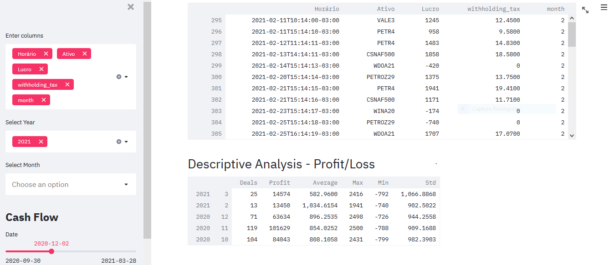

## Office routine tasks 
- Generate and send automatic reports/ dashboard

The main objective of this project is to demonstrate my skills in daily office routine tasks using Python ans it´s libraries. 

**Main objective**: Generate consolidated reports from a trading extract, update cash flow and send email with reports.

**Problem** : Read trade extract file, make reports about day, month and year operations, update cash flow and send email with attachments to a list of people, being possible to add 1 more attachment for each person.
Dashboard.

    

## **Tools**: 
- Python, Streamlit, Heroku

## **Deployment solution:**
- [Dashboard](https://trades-analysis.herokuapp.com/)